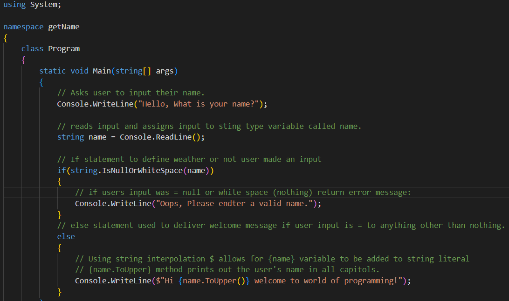

# Coding Challanges

### ***Challenge:***

### ***Challenge: Basic Name Program - 14/05/2025***

1. **Write a simple C# program that:**
- Asks the user to enter their name.
- Reads the user input.
- Create and if / else statement to ensure valid input from user.
- Prints a greeting message that includes their name.

***My Code Solution:***

